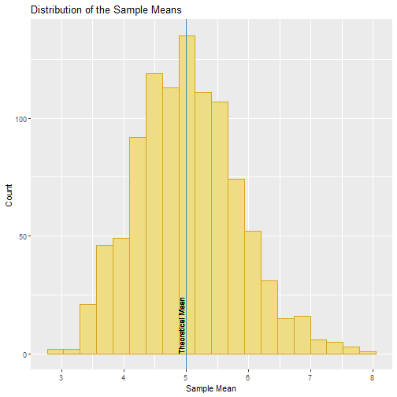

Programming Assignment 3
========================================================
author: 
date: August 29, 2020
autosize: true

What
========================================================

The Central Limit Theorem (CLT) is one of the most important theorems in Statistics. According to the CLT, if you have a bunch of samples which are all drawn independent of each other from the same distribution with mean $\mu$ and variance $\sigma^2$, the distribution of the sample mean converges to the normal distribution with mean $\mu$ and variance $\frac{\sigma^2}{n}$.

Why
========================================================

The CLT is very important because it allows us to make a lot of simplifying assumptions in statistical calculations. However, it also unintuitive. By providing an interactive web app, users will be able to see the sample mean distribution converge to the normal distribution by tinkering with sliders.

How does it work?
========================================================

For example, lets draw $40$ samples from an exponential distribution with $\lambda = 0.2$ and compute their mean. We will repeat this process $1000$ times. After that, we will compare our sample means to the theoretical mean (which for the exponential distribution is $\frac{1}{\lambda} = 5$).


```r
x.raw <- matrix(rexp(1000*40, rate = 0.2), nrow = 40, ncol = 1000)
x <- data.frame(x.raw)
sample_means <- data.frame(means = x %>% summarise_all(mean) %>% unlist(., use.names = FALSE))
theoretical_mean <- 1/0.2
```

Plot
========================================================



Where can I see it?
===

The app is hosted at: https://unwatchedshampoo.shinyapps.io/PA_3/

The github repository is: https://github.com/woodsy-sounding-wilful-sapwood/ShinyAppExample

